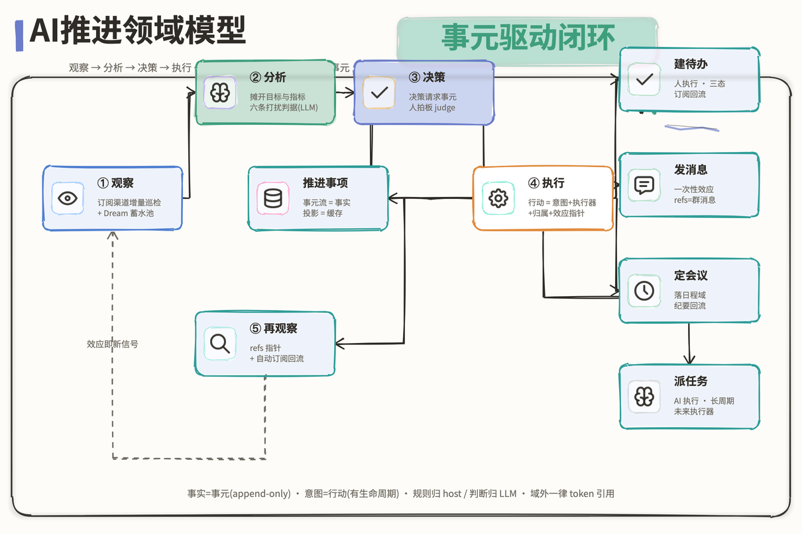

# AI推进领域模型：事元驱动闭环

> 版本：v1.0
> 日期：2026-08-21
> 决策人：Guoxin Shan
> 定位：AI推进的**领域模型视图**——对象、关系、不变量的合同。行为面（工具契约/状态机/门控/判据）以 [`ai-advance-design.md`](ai-advance-design.md) 为准；本文回答「这个域里有什么、为什么恰好是这些」。迁移分层（A 合同 / B 机制 / C 脚手架）见 [`../migration/advance-lingee-migration.md`](../migration/advance-lingee-migration.md)——本文全部内容属 A 层。



图源：[`../diagrams/advance-9-domain-model.html`](../diagrams/advance-9-domain-model.html)（手写 HTML+SVG，直接编辑；PNG 由 playwright 截图生成）。

## 1. 构造方法：环上每段弧必须有载体

领域模型从推进闭环反推：**观察 → 分析 → 决策 → 执行 → 再观察**，每段弧必须有领域对象承载，每次转折必须有落点。缺载体的弧就是模型的缺口。

| 弧 | 载体 | 落点 |
|---|---|---|
| ① 观察 | 上下文来源订阅（ContextSource token）+ Dream 蓄水池（PoolEntry） | 信号被采纳 → 事元 |
| ② 分析 | inspect 比对材料 + 六条打扰判据（**过程不是实体**，是 LLM 判断服务） | 结论 → 事元（进度/偏差/决策请求） |
| ③ 决策 | 决策请求事元 + judge 拍板（用户主权） | 落事元（`操作者=user`） |
| ④ 执行 | **行动 Action**（见 §3） | 执行事元 + 效应指针 |
| ⑤ 再观察 | 效应指针 refs + 效应对象自动进订阅集 | 效应变化 → 新事元，回 ① |

## 2. 领域对象清单

| 对象 | 模式 | 职责 | 可变性 |
|---|---|---|---|
| **推进事项** AdvanceItem | 聚合根 | 标识（advanceId 幂等键）+ 七态状态机 + 投影 | 投影可重建；状态机 host 强制合法流转 |
| **事元** Entry | 领域事件 | 环上一切转折的焊缝：时间 · 来源类型(7) · 变化类型(7) · 摘要 · detail(原值→新值) · refs · 操作者 | **不可变**（append-only，永不裁剪） |
| 投影 Projection | 值对象 | 名称/目标/负责人/目标日期/阶段/背景/指标/最新动态 | 缓存，从流折叠，可重建 |
| **上下文来源** ContextSource | 值对象 | 订阅渠道 token：`im:/doc:/dir:/todo:/event:/file:` | 可关联/解除（user 记录留痕） |
| **蓄水池条目** PoolEntry | 实体 | Dream 待抽取队列（信号副本候车室） | done 标记不删（审计面） |
| **行动** Action | **事元结构化载荷**（决策 44） | 见 §3 | 有生命周期，但生命周期归执行器所在域 |

**刻意不设的对象**：

- **信号**不是实体——渠道本身是信号的存储，蓄水池只存「值得再看一眼」的副本；信号被采纳才获得身份（那条事元）。
- **建议卡**不是实体——= 阶段为 `decision-needed` 的事项 + 最新决策请求事元，纯投影渲染（决策 43 单卡综合）。
- **行动清单/看板队列**不是实体——一切「清单」都是事元流+投影折叠出来的**视图**。

## 3. 行动 Action（闭环推导出的概念）

行动是**决策的下游、再观察的上游**：没有它，「执行→再观察」弧断开，环不闭合。

### 3.1 统一抽象（跨执行器）

```
Action = 意图(做什么) + 执行器(谁执行) + 归属(advanceId)
       + 效应指针(effectRef) + 提出溯源(决策请求 entryId)
```

### 3.2 执行器谱系

| 执行器 | 效应载体 | 生命周期 | 回流路径 |
|---|---|---|---|
| 建待办（人） | todo 域三态 | 长 | `todo:<id>` 订阅 → 事元 |
| 发消息 | 群消息 msgId | 一次性效应 | 无后续态，refs 留痕即终 |
| 定会议 | 日程 eventId | 中（有纪要） | `event:<id>` 订阅 / 纪要回流 |
| **派任务（AI，未来）** | harness 会话/任务 | **长且跨时间，有中间态与产出** | 目前无家——唯一缺载体的执行器 |

### 3.3 生命周期

提出（决策请求事元的动作载荷）→ 执行（用户面板直写 / 未来 AI 触发）→ 效应（effectRef 落执行事元）→ 回流（效应对象自动进订阅集，变化再成事元）。

### 3.4 建模形态：载荷起步，实体化留缝（决策 44）

行动**不设独立实体/表**。当前形态 = 决策请求事元的结构化载荷（动作行，v1.8 文本约定、终态结构化——灵基断层 4）+ 执行事元 refs 留痕。理由：行动的执行态归各执行器域（todo 三态/日程/IM），独立建表 = 双事实源；事元流只载已发生事实，行动是未发生意图，混入破坏 append-only 合同。**实体化接缝**：当 agent 执行器出现且「行动清单」升为一等视图（要看「几条待执行/进行中/效果」）时，同一结构 `{kind, text, fields, effectRef, proposedBy}` 平移为独立 action 面，事元留痕不变。推翻信号：用户问「派出去的事跑到哪了」答不上来；同一动作因 done 态丢失被执行两次。

### 3.5 闭环强制（决策 45）

执行事元**必须**带效应指针 refs（todoId / `im:<groupId>:<msgId>` / eventId / sessionId），且执行后效应对象**自动** `sourceAdd` 进事项订阅集——host 强制，缺失拒写；面板 done 态从事元流折叠重建，废止客户端内存 Set。这是闭环「执行→再观察」弧的成立条件，与「stageTo=decision-needed 必须配决策请求」（决策 41）同型——把闭环纪律从文档变成代码。

## 4. 三条公理（不变量）

1. **唯一变更通道**：一切变更 = feed 一条事元，无 update/delete——投影因此可重建，时间线因此天然完整。
2. **两个分家**：事元 = 已发生事实（不可变）/ 行动 = 待执行意图（有生命周期）；规则（状态机/去重/门控）归 host / 判断（比对/判据/抽取）归 LLM。
3. **生死人主权**：**入口**（立项：`yzj_advance_create` 必确认卡 / 面板直写）与**出口**（终局 `completed`/`cancelled` 只由用户 judge，决策 27/43）都在人手里；环路中段（观察-分析-执行-再观察）AI 自转、静默为默认。

推论：**这个域里只有两种东西——事元与行动**；环就是「行动变事元、事元促行动」的往复。域外（todo/im/doc/calendar/memory）一律 token 引用，不内嵌。

### 4.1 诞生分流：推进事项 vs 待办（决策 46）

事项的诞生走两条路：agent 建议立项（确认卡）/ 用户面板直写。识别到意图时的分流判据：**完成标准自明、一句话说清的单动作 → 待办；有业务目标 + 成功指标 + 需跨时间跟进判断 → 推进事项；拿不准建待办**（轻、可逆；做一半发现需持续跟再升级立项——待办完成经 `todo:<id>` 订阅回流为事元，升级路径常通）。两者不互斥：待办是事项的事元来源，事项的决策卡动作行也能建待办。分流只发生在诞生一刻。

### 4.2 判断的实体化：分析是服务，事元是其非空产出

「分析」（比对/判据/Dream 抽取）是 LLM 判断服务，**过程不是实体、不留痕**（真机实验实测模型判断漂移，过程不可靠）；但判断的**非空产出强制实体化为事元**——结论 + 推论链（detail）+ 证据（refs）三件套：

- 「有影响」→ 落事元：事实与影响是流上的**因果对**（事实事元 refs=[原始信息]，影响事元 detail 写推论链）；偏差事元 detail 必须写清「事实 → 影响了什么 → 为什么」（推论链纪律，v1.9 起）。
- 「无影响但有关」（正常进展/波动消化）→ **仍落事元**（进度更新/备注），只是不推阶段不起卡——静默判据管打扰面，不管记录面；无影响的波动也是演进过程，复盘要看风波与平息。
- 「无关」→ 不落事元；蓄水池副本 done 不删（审计面）+ 渠道源头永远在，下轮 Dream 仍可捞回。
- 判断漂移的隔离：一次误判 = 一条错事元，可被 judge 纠正事元覆盖；大判断（改基准/终局）必须人拍板才生效。

### 4.3 延迟决策登记

- **演进折叠（决策 47）**：事元流之上永不做实体摘要层；视图层折叠（渲染时按段折叠、不落库）等触发信号——用户读时间线说「太长了看不懂这件事经历了什么」；届时折叠键选**目标版本段**（两次「目标更新」事元之间），不选日历周。
- **行动实体化（决策 44 的缝）**：触发信号 = agent 执行器出现 + 「行动清单」升为一等视图（「派出去的事跑到哪了」答不上来 / done 态丢导致重复执行）。

## 5. 当前断点（2026-08-21 盘点，按伤害排序）

1. **回流断**：决策卡建的待办无 refs、未自动订阅 `todo:<id>`——行动结果回不到事项，「执行→再观察」弧开口（决策 45 待实现）。
2. **溯源断**：建待办/发消息执行事元无效应指针；定会议分支连留痕事元都未落。
3. **done 态刷新即丢**：`doneActions` 是客户端内存 Set；决策 45 后从事元流折叠重建，依附于断点 1 修复。

## 6. 与终态的关系

本文全部内容属迁移合同 A 层（灵基终态逐条照抄）。动作行的**文本协议**是 C 层脚手架（断层 4，灵基侧原生结构化）；dbt/SQLite 双表承载是 C 层。行动实体化（若触发决策 44 的推翻信号）在 MVP 侧不做，作为灵基原生推进域的需求输入。
